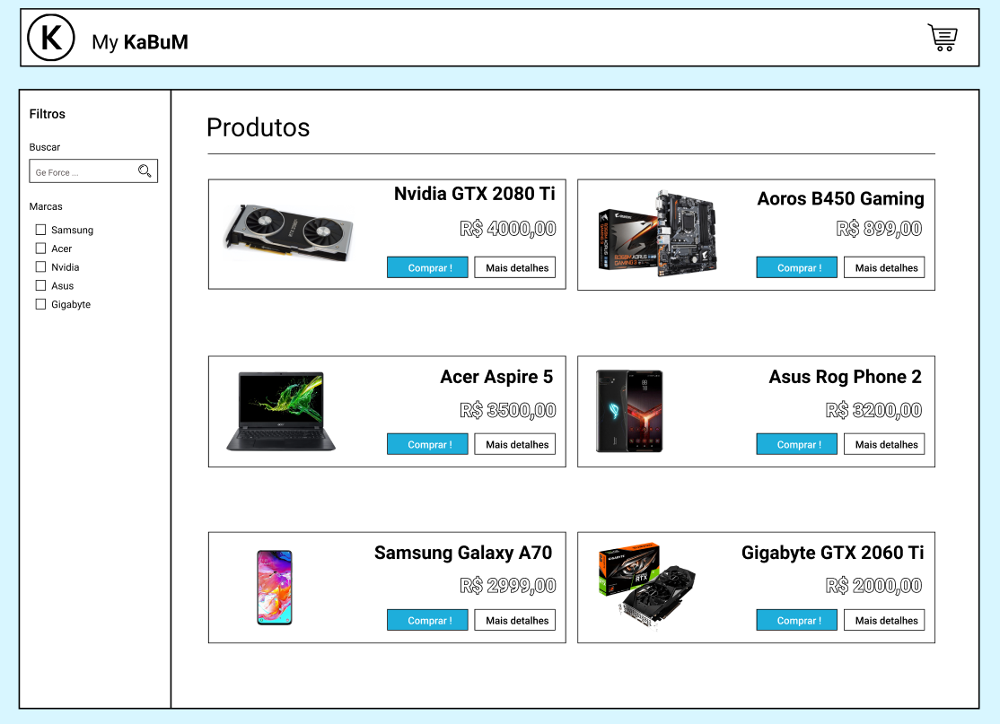

# Sistema de Pedidos ( React com Redux )

Esse projeto é um sistema simples de pedidos que deverá ser implementado
com a biblioteca React com Redux para state management.

## Overview
Esse documento mostra os requisitos e o processo de desenvolvimento do
app.

## Requisitos

* O sistema deverá ser em React com redux.
* Deverá conter uma rota de listagem e descrição de produtos.
* O layout deverá ser criado pelo desenvolvedor.
* Os dados devem vir de um MOCK API.
* Deverá existir a possibilidade de adicionar o produto no carrinho.
* Acrescentar e diminuir a quantidade.
* Remover do carrinho.
* Deverá ser possível acessar o carrinho com os produtos em qualquer
tela do sistema.
* Na listagem, deverá ser possível filtrar pelo nome dos produtos ou id.
* Utilizar alguma metodologia css ou JSS ou Styled Component.

## Processo de desenvolvimento
Aqui abordaremos como foi feito o processo de desenvolvimento.
Como os requisitos já estavam bem definidos, decidi começar
com a prototipação das telas e pensar em como organizar os componentes e
o estado do projeto.

### Protótipo
Para fazer o protótipo do projeto, usei a ferramenta Figma, que é
gratuíta e muito poderosa.

O projeto Figma pode ser encontrado nesse [link](https://www.figma.com/file/Muy6HRxFgSD3GZCOM0yQhv/Ordering-System?node-id=0%3A1).

#### Home Page



### Criação do projeto
O projeto foi criado com o clássico comando:

```
    npx create-react-app ordering-system
```

Depois as dependencas para o Redux com React foram adicionadas:

```
    npm install redux react-redux redux-thunk --save
```

Mesmo esse sendo um projeto pequeno decidi adicionar o redux-thun para
caso em algum momento seja necessário expandi-lo.

node node_modules/react-scripts/scripts/start.js
